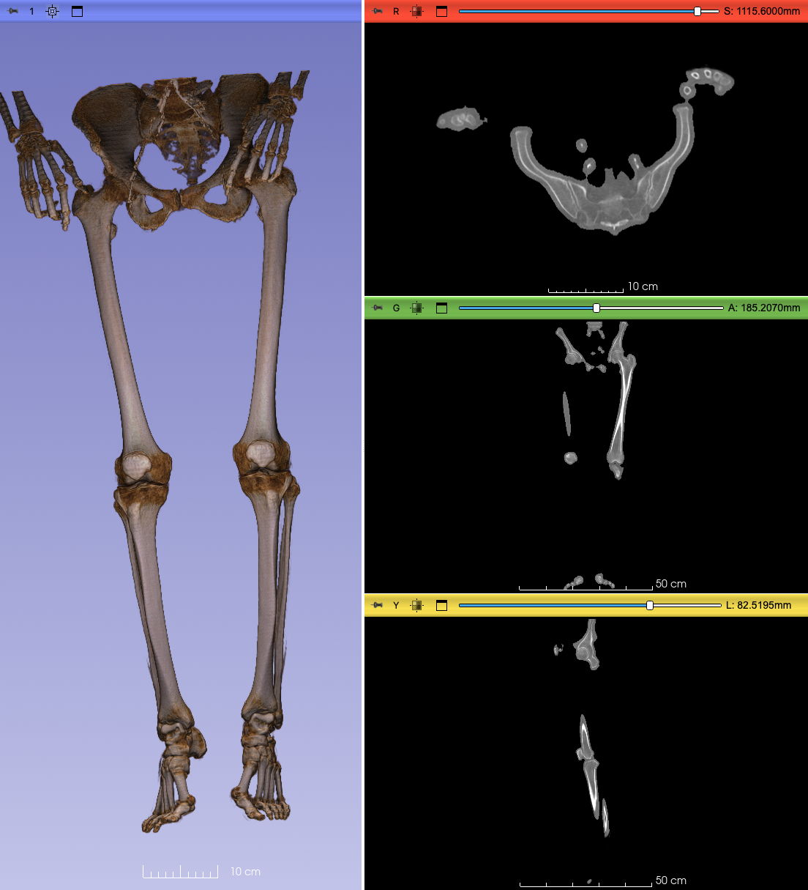

## MorphoDepot Repository
Repository for segmentation of a specimen scan.  See [this JSON file](MorphoDepotAccession.json) for specimen details.
* Species: Homo sapiens
* Modality: Medical CT
* Contrast: No
* Dimensions: (802, 549, 1768)
* Spacing (mm): (0.6000000000000001, 0.6000000000000001, 0.6000000000000001)

## Screenshots

